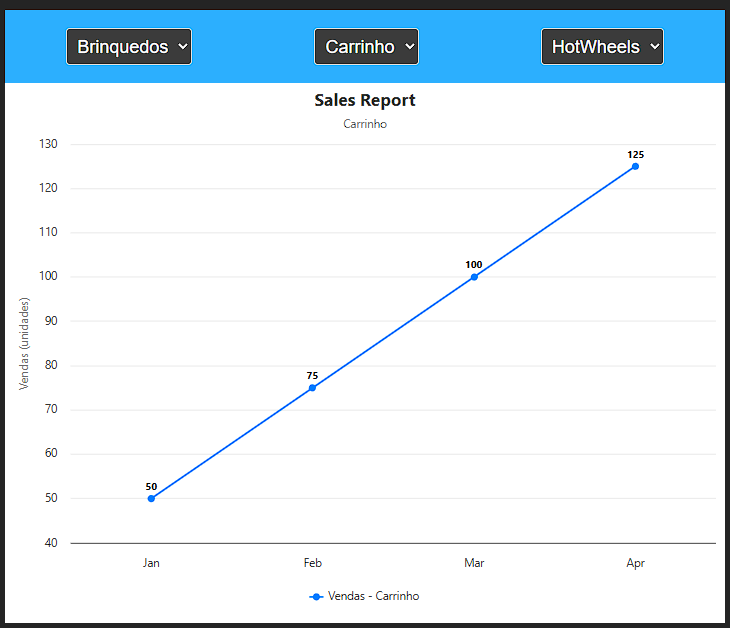

🚀 ## **Tecnologias**
  
* Vue 3 - Framework JavaScript progressivo

* TypeScript - Superset JavaScript com tipagem estática

* Highcharts - Biblioteca para criação de gráficos interativos

* highcharts-vue - Integração oficial do Highcharts com Vue

* Vite - Ferramenta de build e desenvolvimento

**Clone o repositório**
1. git clone <url-do-repositorio>
2. cd challenge-all-tax

**Instale as dependências**
1. npm install
##### ou
2. yarn install

**Execute em modo de desenvolvimento**
1. npm run dev
##### ou
2. yarn dev

###### challenge-all-tax
